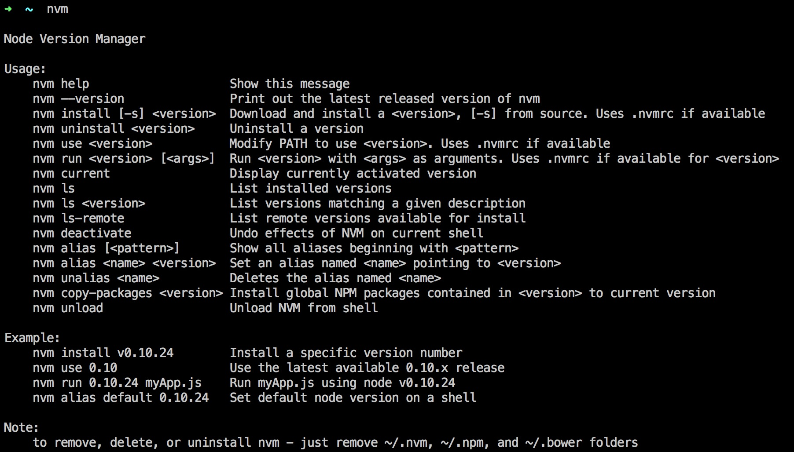

快速搭建Node开发环境(Win && Linux && OSX)
============

本节内容包括如何在各平台上快速搭建Node开发环境，及开发环境相关提示。

----------------

### Node版本介绍

Node目前还未发布1.0正式版，目前Node仍处于快速更新和API不完全稳定的阶段。Node版本规律同Linux内核版本一样，所有的奇数版本都是不稳定版本，所有的偶数版本都是稳定版。在[此dist](http://nodejs.org/dist/)下的可以看到Node所有版本的文件，在[此wiki](https://github.com/joyent/node/wiki)下可以看到Node官方更新说明及未来发展。

到我写这篇文章时，Node的最新版本为v0.11.14,我推荐大家使用v0.11.14版本作为目前的开发和生产环境版本。原因主要有三点：

1. v0.11版本支持JSES6特性，ES6作为ECMAScript历史上的一个极其重要的版本，引入了大量优秀的语言特性，值得学习和使用。
2. v0.11版本修复了v0.10版本下Cluster负载均衡的问题，新版本才可以在生产环境调用CPU多核真正均衡负载。
3. 新版本是未来。

### 利用nvm快速切换Node版本

如果希望长期做Node开发，追随新版本发布，在各个Node版本间迅速切换，其实用nvm (Linux && OSX) 或nvmw (Win) 安装Node，保证系统的Node版本整洁。

#### Linux,OSX环境

在终端中运行一下命令：

	curl https://raw.githubusercontent.com/creationix/nvm/v0.17.3/install.sh | bash

或Wget：

	wget -qO- https://raw.githubusercontent.com/creationix/nvm/v0.17.3/install.sh | bash

The script clones the nvm repository to `~/.nvm` and adds the source line to your profile (`~/.bash_profile`, `~/.zshrc` or `~/.profile`).You can customize the install source, directory and profile using the `NVM_SOURCE`, `NVM_DIR`, and `PROFILE` variables. Eg: `curl ... | NVM_DIR=/usr/local/nvm bash` for a global install.

在终端中输入`nvm`，你应该看到：

	
#### Windows环境