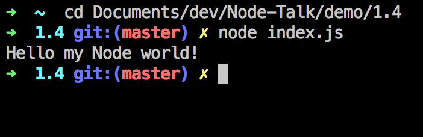
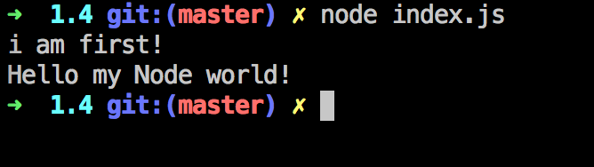

从hello world看Node的运行
===================

在你喜欢的路径建立hello-node文件夹，开始你的Node之旅。

建立如下的目录结构：

```
 -- hello-node
	|- index.js
	|- hello.txt
```

hello.txt的内容为：`Hello my Node world!`。

index.js的内容为：

```
'use strict';

var fs = require('fs');
var path = require('path');

fs.readFile(path.join(__dirname, 'hello.txt'), function (err, data) {
  if(err) throw err;
  console.log(data.toString());
});
```

在终端中进入相应目录，运行`node index.js`，这就是你的第一个Node程序。



1. `'use strict';`
	
	众所周知，Node是服务器端的JS运行环境，JS语言是ECMAScript的实现，目前最新标准是ES5，ES6、ES7的标准正在制定中，`'use strict';`即是使用“严格模式（strict mode）”，一个子集用作提供更彻底的错误检查,以避免结构出错。澄清了许多第3版本的模糊规范，修正了JS语言本身的一些问题。

2. `var fs = require('fs'); var path = require('path');`

	Node本身有许多内建核心模块，由内建的核心模块组合、编写，又衍生出千千万万的自建模块，同时你也可以通过编写C++扩展模块，实现JS语言不能实现的更高级功能，对于模块之间的互相引用，Node选择了CommonJS规范，实现了一套高效、使用、简洁的模块系统。
	
	你可以通过`require`引用别人编写发布或核心模块，调用模块所暴露的公开方法，编写自己的模块。自己的模块编写好后，可以打包发布到Node官方包管理系统npm中，供全世界开发者引用。这一套简单却有效的集中式包管理系统，是Node快速发展壮大的一个重要原因。

3. `path.join`是一个同步的方法，也就是说，这个方法是“阻塞的”。不要惊讶和担心，这个方法只依赖于cpu计算，可以以忽略不计的时间返回。`__dirname`是一个绑定在`Globle`对象下的全局的对象，返回这个文件的绝对路径。`path.join`用于拼接路径，进而产生你需要的绝对路径或相对路径。
	
4. `fs.readFile`fs模块，提供了许多文件操作方法，其中以readFile最为典型。readFile方法，asynchronously reads the entire contents of a file，即异步返回读取到的文件内容。运行到这句时，程序向fs模块发出了一个readFile指令，然后没有等待readFile方法立即返回，而是直接继续运行之后的语句。readFile方法会在后台的另外的线程中进行系统文件IO，读到内容后触发作为第二个参数出入的`回调函数`，这即为Node`异步`的实现。所以以下代码的执行结果是：

	```
	'use strict';

	var fs = require('fs');
	var path = require('path');
	
	fs.readFile(path.join(__dirname, 'hello.txt'), function (err, data) {
	  if(err) throw err;
	  console.log(data.toString());
	});
	
	console.log('i am first!');
	```
	
	
	
5. `function (err, data) { if(err) throw err; console.log(data.toString());}`

	这个匿名函数，是作为`回调函数`传入函数的。Node界，一个约定即是回调函数第一个参数是error，如果程序执行时发生错误，回调时会出入这个错误，即`callback(err, null);`。如果正常运行，回调是第一个参数会为空，第二个之后的参数才是运行结果，即`callback(null, result);`。
	
	在这个回调函数中，如果接收到错误，会把这个错误继续向上抛出，如果最后错误传到了最外层，即会引发进程的崩溃。data为buffer结构的文件内容，`data.toString()`即会按`utf-8`编码把buffer转换成字符串，最后用`console.log`方法输出。
	
	Node的运行环境只支持`utf-8`编码，其他非`utf-8`编码的字符，均以二进制的形式存储。
	
6. 这是使用ES5语法实现的示例，在以后的callback hell部分，我会介绍利用ES6语法，异步也可以有更优美的实现。
	
以上就是Node的`hello world`代码，现在和我一起说：

###Hello my Node world!