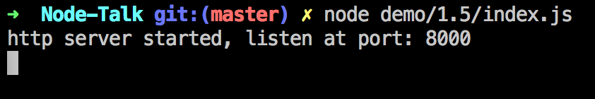
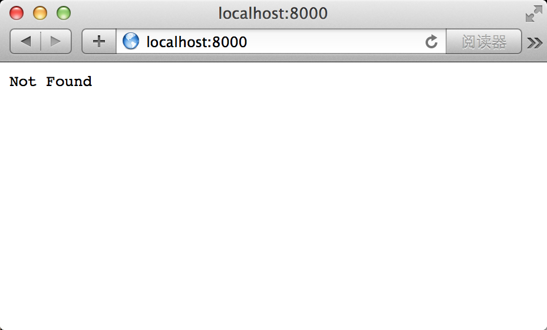
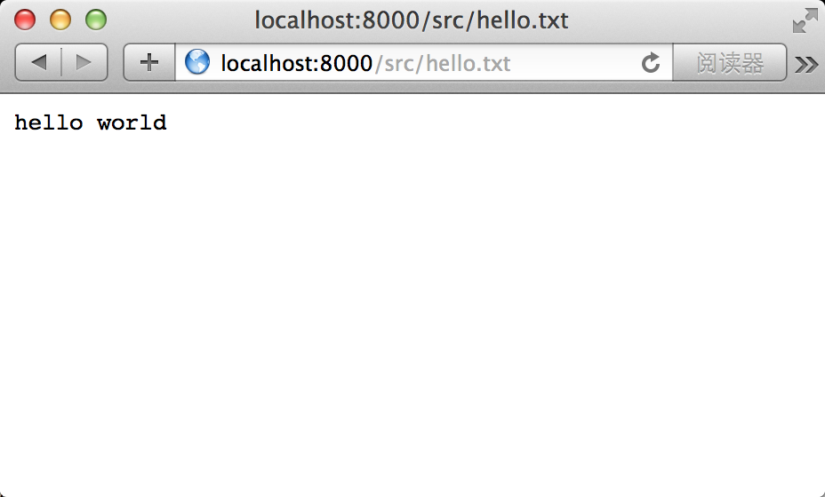
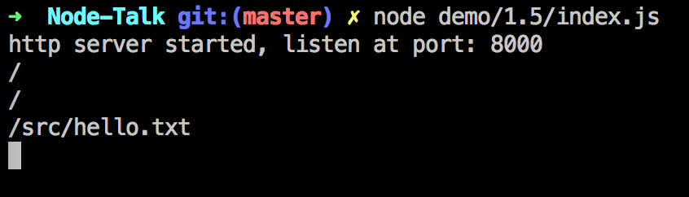

利用Node原生方法搭建WEB服务器
===========================

Node作为火热的服务器端JavaScript环境，提供WEB服务是Node的强项，但原生的异步编程模式，是新手入门的一道门槛，下面我就介绍一下使用Node原生方法搭建简单的文件服务器：

```
var http = require('http');
var fs = require('fs');
var path = require('path');
var url = require('url');

http.createServer(function (req, res) {
  console.log(req.url);
  fs.readFile(path.join(__dirname, req.url), {encoding: 'utf8'}, function (err, data) {
    if(err) {
      res.statusCode = 404;
      return res.end('Not Found');
    };
    res.end(data);
  });
}).listen(8000);

console.log('http server started, listen at port: 8000');
```

1. `http.createServer`返回一个服务器对象，可以通过listen方法，异步监听系统端口，监听1024以下端口需要`sudo`权限，所以推荐监听不常用的高端口。

2. 需要传入`http.createServer`的参数是一个Function，这个Function的参数是`request`对象和`response`对象，在函数中你可以读取请求对象的信息，进行处理，生成相应信息，写入相应对象。这个Function，会被自动绑定到服务器对象的`request`事件。

3. `console.log(req.url);`命令打印了请求的链接，你可以在控制台查看到每次请求的链接。

4. 如果你请求的链接对应的文件存在，则读取返回；否则会在运行`fs.readFile`时产生错误，返回404;

5. 可以通过调用`response`对象的众多方法修改相应信息。

在终端中运行它：


在浏览器中建立请求：


如我们所想，因为`/`路径对应的是一个目录，而不是一个文件，读取时会产生错误，所以会返回404。

在浏览器中建立请求：


如我们所想，当访问有效的文件路径时，Node服务器读取了文件内容，并返回给了浏览器。

在终端中我们可以看到每一次请求的路径：
